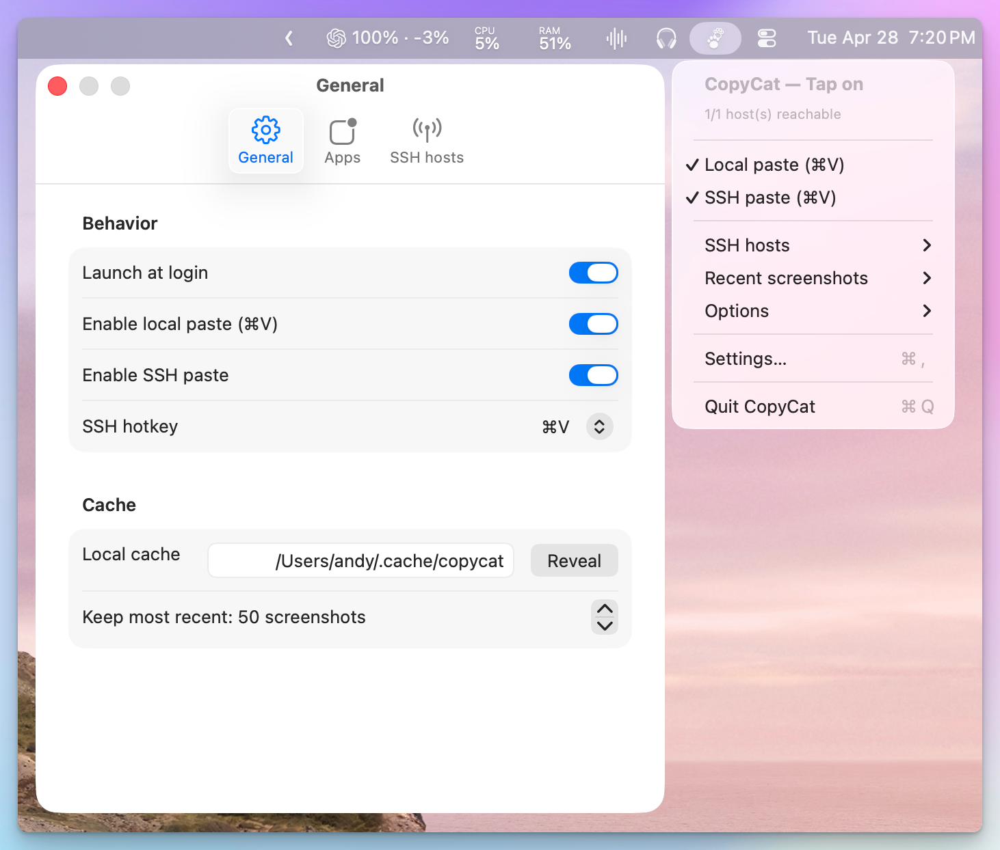
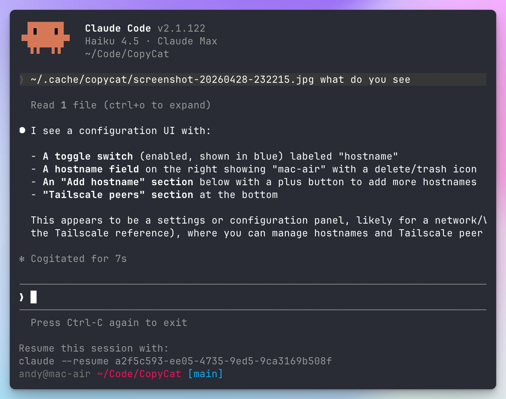

<h1 align="center">CopyCat</h1>

<p align="center">
  CopyCat makes ⌘V work for screenshots in your terminal. It saves the clipboard image to disk and types the file path so CLI tools like Claude Code can read it. The same flow works over SSH — paste a screenshot into a remote terminal as easily as a local one.
</p>

<p align="center">
  
  
  
  
  
</p>

<p align="center">
  <a href="#getting-started">Getting Started</a> ·
  <a href="#features">Features</a> ·
  <a href="#configuration">Configuration</a>
</p>

<p align="center">
  
</p>

<p align="center">
  
</p>

## Getting Started

1. [**Download CopyCat**](https://github.com/andyhtran/CopyCat/releases/latest/download/CopyCat.dmg)
2. Open the DMG and drag the app to your Applications folder
3. Launch CopyCat (look for the paw icon in the menu bar)
4. Grant Accessibility permission when prompted — required for ⌘V interception
5. Copy any image, then press **⌘V** in your terminal — the file path is typed for you

To paste into remote terminals over SSH, click the menu bar icon → **Settings… → General → Enable SSH paste**, then add hosts in the **SSH hosts** tab. If Tailscale is installed, peers show up for one-click add.

<details>
<summary>Other install methods</summary>

### Homebrew

```bash
brew install --cask andyhtran/tap/copycat
```

To upgrade to the latest release:

```bash
brew update && brew install --cask copycat
```

### Build from source

Requires macOS 14+ (Sonoma) and Swift 6+.

```bash
git clone https://github.com/andyhtran/CopyCat.git
cd CopyCat
just dev
```

</details>

## Features

- **Paste-as-path** — copy any image, press ⌘V in a terminal, the file path is typed
- **Works over SSH** — push the same screenshot to remote hosts so ⌘V works in a remote shell too
- **Tailscale-aware** — if Tailscale is installed, peers show up for one-click add; otherwise add hostnames manually
- **Configurable apps** — defaults to common terminals (Ghostty, iTerm2, Terminal, WezTerm, Alacritty, kitty, Warp); add your own
- **Cache pruning** — keeps the most recent N screenshots on disk; older ones get pruned automatically
- **On-device** — no telemetry; nothing leaves your machine except SSH connections you explicitly configure

## Configuration

Everything is configured in the CopyCat menu bar → **Settings…**:

- **General** — launch at login, local paste toggle, SSH toggle, SSH hotkey, cache directory, retention
- **Apps** — bundle IDs of apps where paste is intercepted
- **SSH hosts** — remote hosts; if Tailscale is installed, peers list with one-click add. Hosts are SSH'd as the current user (`ssh hostname`) — your `~/.ssh/config` and key auth apply.

## FAQ

**Local paste types `/Users/you/.cache/copycat/…`, but SSH types `~/.cache/copycat/…`. Why the difference?**

Local paste uses the absolute path because it works in *every* paste target — shells, REPLs, GUI dialogs, config files, sudo'd shells, IDE prompts, browsers. Tilde only expands inside a shell.

SSH paste has to use `~/` because the remote home dir is unknown. Your remote user might be a different name, on Linux (`/home/you`), or in a different layout entirely. Tilde gets expanded by the *remote* shell to whatever's correct on that host.

**What happens with multiple SSH hosts?**

Each screenshot is sent to every enabled host you've configured. With one host it's just SSH paste; with multiple it broadcasts (fans out) to all of them. Toggle individual hosts on/off in the menu bar to control which ones receive a given screenshot.

**Why does CopyCat use `~/.cache/copycat/` instead of `~/Library/Caches/`?**

So the same path resolves on both your Mac and remote Linux/NixOS hosts. SSH paste types `~/.cache/copycat/screenshot.jpg` into the terminal — that path needs to work on both sides without platform detection or separate configuration. The cache directory is configurable in Settings if you prefer a different location.

**What's the simplest setup?**

Leave SSH off. CopyCat then only intercepts ⌘V locally — no SSH, no remote hosts, no Tailscale needed. Turn SSH on when you want to paste into a remote shell.

## Uninstall

```bash
pkill -x CopyCat
rm -rf "/Applications/CopyCat.app" "/Applications/CopyCat Dev.app"
defaults delete com.copycat.macos.app   # or your COPYCAT_BUNDLE_ID
# Then in System Settings → Privacy → Accessibility, remove the entry.
```

## License

[MIT](LICENSE)
